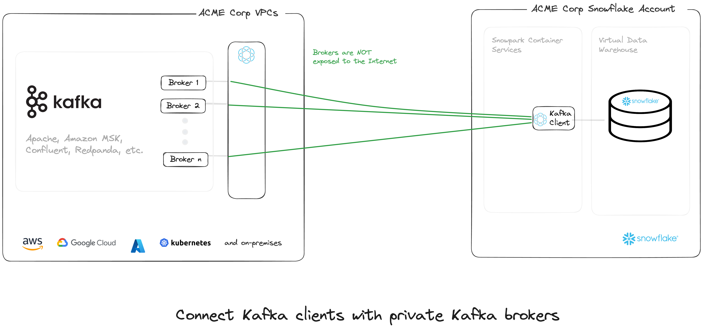

# Change Data Capture from Snowflake to Kafka as a native application



This example shows how data changes in Snowflake can be captured and exported to a private Kafka broker for later
consumption. This is a Change Data Capture (CDC) scenario.

There are three main steps involved in that setup:

1. Enroll with an Ockam and create the credentials necessary to establish a secure channel between the Snowflake native
   application and Kafka.
2. Setup a Kafka instance which will receive the data change events.
3. Deploy a Snowflake native app which will listen to the change events on some tables and will publish them to the
   Kafka.

The communication between Snowflake and Kafka will be mediated by two Ockam nodes, the first one running inside the
Snowflake
native application and the second one running alongside the Kafka broker.

## Prerequisites

In order to run this example you need to install the following:

- Ockam,
  with `curl --proto '=https' --tlsv1.2 -sSfL https://install.command.ockam.io | bash && source "$HOME/.ockam/env"`.
- [Docker](https://docs.docker.com/get-docker).
- [Snowflake-cli](https://docs.snowflake.com/en/developer-guide/snowflake-cli-v2/installation/installation).
- `envsubst` (via the `gettext` package on [Mac](https://formulae.brew.sh/formula/gettext),
  and [Linux](https://www.gnu.org/software/gettext/gettext.html)).

## Get started with Ockam

[Signup for Ockam](https://www.ockam.io/signup) and then run the following commands on your workstation:

```sh
# Enroll with Ockam Orchestrator.
ockam enroll

# Create an enrollment ticket for the node that will run inside the native application.
export INLET_TICKET="$(ockam project ticket --usage-count 1 --expires-in 10h --attribute snowflake-kafka-inlet)"

# Create an enrollment ticket for the node that will run alongside the Kafka broker.
export OUTLET_TICKET="$(ockam project ticket --usage-count 1 --expires-in 10h --attribute snowflake-kafka-outlet --relay kafka)"

# Print the egress allow list for your Ockam project. You will use them later in this example.
export EGRESS_ALLOW_LIST="$(ockam project show --jq .egress_allow_list | sed "s/\"/'/g" | sed "s/\[/(/g" | sed "s/\]/)/g")"
```

## Choose between creating an Amazon MSK vs Kafka cluster running on local machine

On the Kafka side, you can either decide to use the Kafka managed service from
Amazon ([MSK](https://aws.amazon.com/msk/),
or install a local Kafka broker just for this example.

### Setup Amazon MSK

Run the provided Cloudformation template to create:

1. A private Amazon Managed Kafka cluster.
2. An EC2 machine running an Ockam outlet node which will receive encrypted data from Snowflake.

```sh
cd amazon_msk
STACK_NAME=test-msk

aws cloudformation create-stack \
    --region us-west-1 \
    --stack-name $STACK_NAME \
    --template-body file://./msk-private-cluster.yaml \
    --parameters ParameterKey=EnrollmentTicket,ParameterValue=$OUTLET_TICKET \
    --capabilities CAPABILITY_IAM

cd -
```

### Setup Apache Kafka

Otherwise you can start a local Apache Kafka Server with Ockam, via the provided Docker compose file:

```sh
docker compose -f ./docker_kafka/docker-compose.yml up &> /dev/null &
```

In that case Docker compose starts two processes:

1. A Kafka broker.
2. An Ockam outlet node which will receive encrypted data from Snowflake.

You can check that the Kafka broker started properly by opening up the console at http://localhost:8080

## Setup Snowflake

On the Snowflake side we need to:

1. Create a database and some tables that we will update to generate data change events.
2. Deploy the `cdc_publisher` application.

### Create the database

First you need to create a version of the SQL creation script containing your Snowflake user name with:

```
export USER_NAME=<your user name here>

cat ./cdc_publisher/database.sql | envsubst | snow sql --stdin
```

### Build the native application

The native application uses two Docker images:

1. One image for the service which stream data change events from Snowflake tables.
2. One image for the Ockam node which encrypts the data before it is sent to Kafka.

The first image is built with:

```
docker build --rm --platform linux/amd64 -t cdc_publisher:cdc ./cdc_publisher/application/services/cdc_publisher 
```

The second image is built with:

```
docker build --rm --platform linux/amd64 -t ockam_inlet:cdc ./cdc_publisher/application/services/ockam_inlet 
```

Then we publish those images to the Snowflake image repository created in the previous section.
First, we get the repository URL:

```sh
# Login
snow spcs image-registry login

# Get the repository URL
export REPOSITORY_URL="$(snow spcs image-repository url cdc_database.cdc_schema.cdc_repository --role cdc_role)"
```

We tag each image with the repository URL:

```shell
docker tag cdc_publisher:cdc $REPOSITORY_URL/cdc_publisher:cdc
docker tag ockam_inlet:cdc $REPOSITORY_URL/ockam_inlet:cdc
```

We push the images to the repository:

```shell
docker push $REPOSITORY_URL/cdc_publisher:cdc
docker push $REPOSITORY_URL/ockam_inlet:cdc
```

We can run the following command to confirm that the images have been correctly uploaded:

```shell
snow spcs image-repository list-images cdc_database.cdc_schema.cdc_repository --role cdc_role
```

## Deploy the application

Now we can deploy and instantiate the application:

```shell
snow app run --project ./cdc_publisher/application
```

If that step is successful you should see a message like:

```shell
Your application object (cdc_publisher) is now available:
https://app.snowflake.com/HYCWVDM/ekb57526/#/apps/application/CDC_PUBLISHER
```
